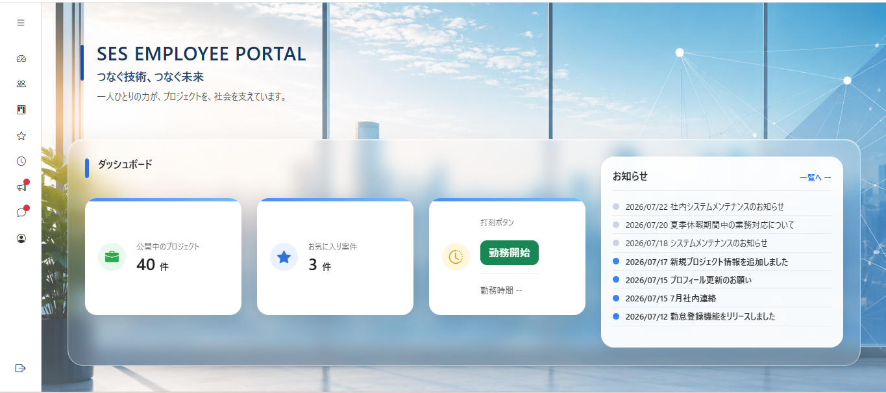
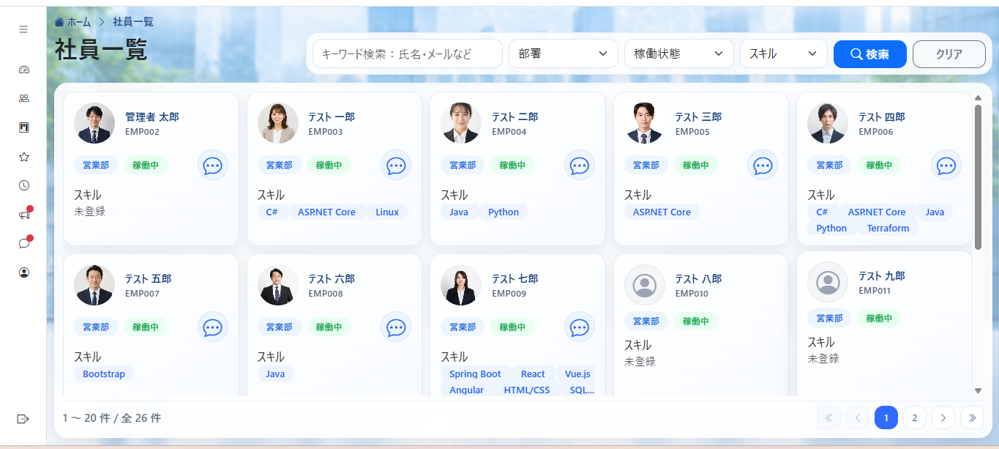
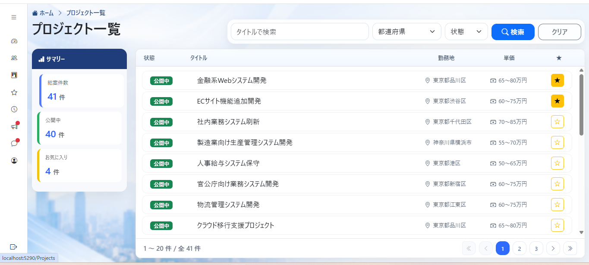
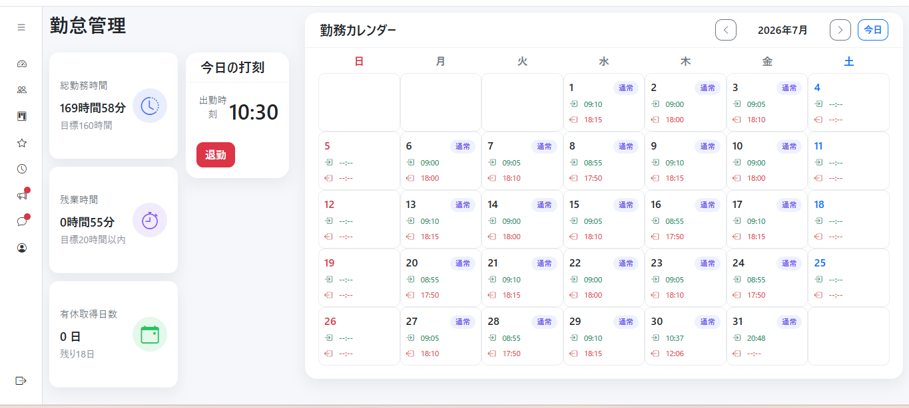
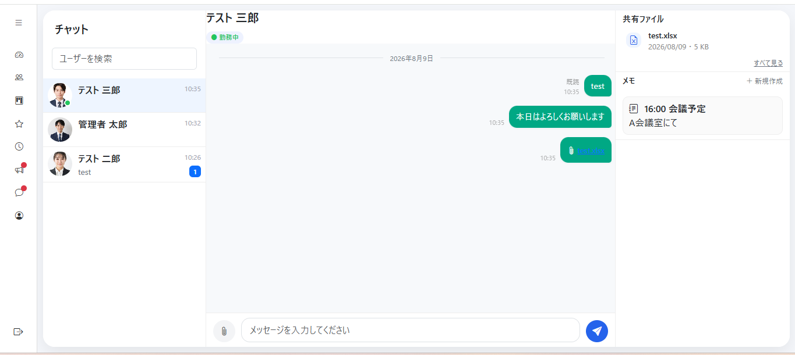
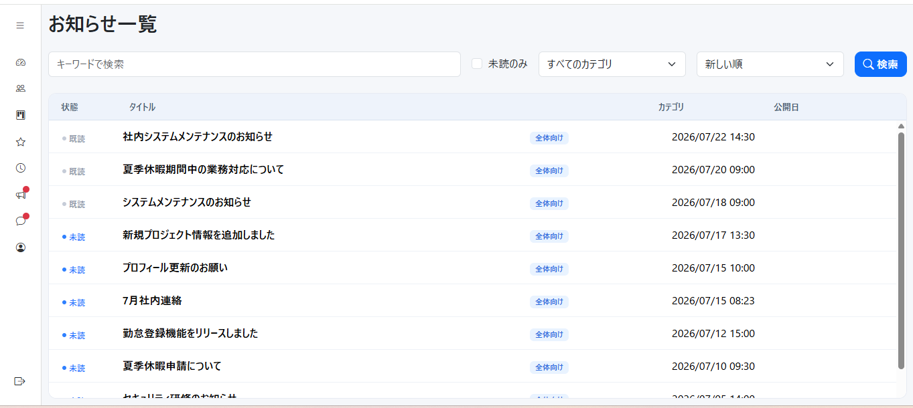

# SES-Portal

SES企業を想定して開発した、**社内ポータルシステム**です。

社員情報・プロジェクト情報の管理を中心に、勤怠管理、チャット、お知らせ、SES業務を想定した複数の機能を実装しています。
個人開発を通して、CRUD処理だけでなく、**認証・認可、データベース設計、Service層による責務分離、リアルタイム通信、論理削除、UI/UX改善**まで一通り経験することを目的として開発しました。

---

## Demo

Azure App Service上にデプロイしたデモ環境を公開しています。

**Demo:** https://ses-portal-yonsei-e8gnecg5guccb5c6.japanwest-01.azurewebsites.net/

### Demo Account

| 権限         | Email                                                                              | Password  |
| ------------ | ---------------------------------------------------------------------------------- | --------- |
| 一般ユーザー | [test1@test.com](mailto:test1@test.com) ～ [test7@test.com](mailto:test7@test.com) | Test1234! |
| 管理者       | 未実装                                                                             | 未実装    |

一般ユーザーは、以下のアカウントでログインできます。

- `test1@test.com` ～ `test7@test.com`
- Password: `Test1234!`

※ デモ環境では実在の個人情報を使用せず、すべてサンプルデータを使用しています。
※ 管理者権限および管理者向け機能は未実装です。
※ デモ環境は動作確認を目的として公開しています。

---

# Overview

### システム概要

SES企業における社員・プロジェクト管理業務を想定したWebアプリケーションです。
社員情報やプロジェクト情報を一元管理し、社員のスキル・自己紹介、お気に入り、勤怠、社員間チャットなどを一つのポータルに集約しています。
また、ASP.NET Core Identityを利用した認証・認可を実装し、ユーザーの権限に応じて利用可能な機能を制御しています。
※管理者用の機能として、諸データの作成や編集・削除機能の追加を予定しておりますが、現在未実装です。

---

# Main Features

## Dashboard


ログイン後のトップ画面です。

- プロジェクト数表示
- お気に入りプロジェクト数表示
- 打刻ボタン表示
- お知らせ表示（最新7件）

---

## Employees


社員情報を管理します。

- 社員一覧
- 社員検索
- 社員詳細
- 社員プロフィール
- スキル情報
- 自己紹介
- プロフィール画像
- 入社日・経験年数
- 部署情報

---

## Projects


SESプロジェクトを管理します。

- プロジェクト一覧
- プロジェクト検索
- プロジェクト詳細
- プロジェクトメンバー管理
- お気に入りプロジェクト

---

## Attendance Management


社員の勤怠を管理します。

- 出勤
- 退勤
- 勤怠カレンダー
- 月別表示
- 勤怠履歴
- 勤怠集計
- 休憩時間管理
- 残業時間計算

勤怠処理については、勤務時間に応じた休憩時間や8時間を超えた勤務時間を考慮した計算を行っています。

---

## Chat


SignalRを利用したリアルタイムチャット機能です。

- チャットルーム
- リアルタイムメッセージ送信
- 未読件数表示
- 既読状態
- ルーム一覧の更新
- ファイル送信
- 共有ファイル一覧
- チャットメモ
- メモの作成・編集・削除

チャットメッセージの送受信には **ASP.NET Core SignalR** を使用しています。

---

## Announcements


社内向けのお知らせを管理します。

- お知らせ一覧
- お知らせ詳細
- カテゴリ管理
- 公開状態管理
- 既読管理
- 未読表示
- 検索
- 並び替え

---

## Authentication / Authorization

ASP.NET Core Identityを利用しています。

- ログイン
- ログアウト
- ユーザー管理
- ロール管理
- 権限による画面制御
- 管理者機能
- Claimsによるユーザー情報取得

---

# Technology Stack

| Category                | Technology               |
| ----------------------- | ------------------------ |
| Framework               | ASP.NET Core Razor Pages |
| Language                | C#                       |
| Runtime                 | .NET 10                  |
| ORM                     | Entity Framework Core    |
| Database                | SQLite                   |
| Authentication          | ASP.NET Core Identity    |
| Real-time Communication | SignalR                  |
| Frontend                | HTML / CSS / JavaScript  |
| UI Framework            | Bootstrap                |
| Development Environment | Visual Studio Code       |
| Version Control         | Git / GitHub             |

---

# Architecture

基本的には、**Razor Pages → Service → DbContext → Database**という構成を採用しています。

```text
┌──────────────────────────────┐
│        Razor Pages           │
│     UI / HTTP Request        │
└──────────────┬───────────────┘
               │
               ↓
┌──────────────────────────────┐
│          Services            │
│ Business Logic / Processing  │
└──────────────┬───────────────┘
               │
               ↓
┌──────────────────────────────┐
│        AppDbContext          │
│       Entity Framework       │
└──────────────┬───────────────┘
               │
               ↓
┌──────────────────────────────┐
│            SQLite            │
└──────────────────────────────┘
```

---

# Project Structure

```text
SES-Portal/
│
├── Areas/
│   └── Identity/
│
├── Data/
│   ├── AppDbContext.cs
│   └── IdentitySeeder.cs
│
├── Enums/
│
├── Extensions/
│
├── Helper/
│
├── Models/
│
├── Pages/
│   ├── Announcements/
│   ├── Attendances/
│   ├── Chat/
│   ├── Employees/
│   ├── MyPage/
│   └── Projects/
│
├── Services/
│   ├── AnnouncementService.cs
│   ├── AttendanceService.cs
│   ├── ChatService.cs
│   ├── EmployeeService.cs
│   ├── ProjectService.cs
│   └── ...
│
├── ViewModels/
│
├── wwwroot/
│   ├── css/
│   ├── images/
│   └── js/
│
├── Program.cs
├── appsettings.json
├── .gitignore
└── SES-Portal.csproj
```

---

# Design Considerations

## Service Layerによる責務分離

当初、Razor PageModelに集中していたデータアクセス・業務処理をService層へ分離しました。

```text
PageModel
    ↓
Service
    ↓
DbContext
```

これにより、

- PageModelの肥大化を防止
- 業務ロジックの集約
- 再利用性の向上
- テスト・保守性を考慮した構成

を実現しています。

---

## Current User Management

ログインユーザーから社員情報を取得する処理を共通化しています。

複数画面で同じログインユーザー取得処理を記述するのではなく、共通Serviceを利用することで、ユーザー情報取得処理の重複を削減しています。

---

## Logical Delete

社員・案件など、一部のデータについて物理削除ではなく論理削除を採用しています。

```text
IsDeleted = true
```

とすることで、データを保持したまま通常の一覧から除外します。

---

## SignalRによるリアルタイム通信

チャット機能では、通常のHTTPリクエストだけではなくSignalRを利用しています。

```text
User A
  │
  │ Message
  ↓
SignalR Hub
  │
  ├────────→ User B
  │
  └────────→ Room / Notification
```

これにより、ページをリロードせずにメッセージや未読状態をリアルタイムに更新できるようにしています。

---

# Database

SQLite + Entity Framework Coreを使用しています。

主なエンティティ：

```text
Employee
Department
Skill
EmployeeSkill
Project
ProjectMember
FavoriteProject
Attendance
Announcement
AnnouncementRead
ChatRoom
ChatMessage
ChatMemo
```

社員・案件・チャット・勤怠などの関連性をEntity Framework Coreのリレーションとして定義しています。

---

# Security

ASP.NET Core Identityを利用して認証・認可を実装しています。

また、GitHub公開時には以下のような開発環境固有のデータをリポジトリから除外しています。

```text
*.db
appsettings.Development.json
bin/
obj/
wwwroot/uploads/
```

データベースやアップロードされたファイルなど、実データをGitHubへ公開しない構成としています。

---

# Development History

開発では、基本的なCRUD機能から段階的に機能を追加しました。

```text
CRUD
 ↓
EF Core / SQLite
 ↓
Service Layer
 ↓
Identity / Authentication
 ↓
Role / Authorization
 ↓
Employees
 ↓
Projects
 ↓
Dashboard
 ↓
Favorite Projects
 ↓
Attendance
 ↓
SignalR Chat
 ↓
File Sharing
 ↓
Chat Memo
 ↓
Announcements
 ↓
UI / UX Improvements
```

機能追加だけでなく、実装後のUI調整や共通化、責務分離などのリファクタリングも行っています。

---

# Future Improvements

今後は以下の改善を予定しています。

- クラウド環境へのデプロイ
- デモ環境の構築
- データベースの本番環境対応
- README / 設計資料の充実
- 自動テストの追加
- CI/CDの導入
- エラーハンドリングの強化
- ログ管理の強化
- パフォーマンス改善

---

# Author

**Yonsei M.**

個人開発として、業務システムの設計・実装・改善を通して、バックエンドからフロントエンド、データベース、認証・認可、リアルタイム通信まで幅広く学習しています。
